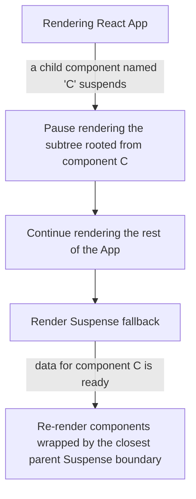
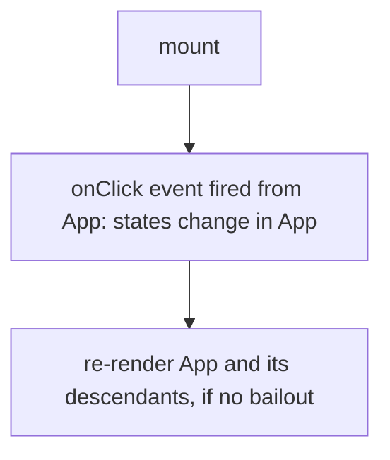
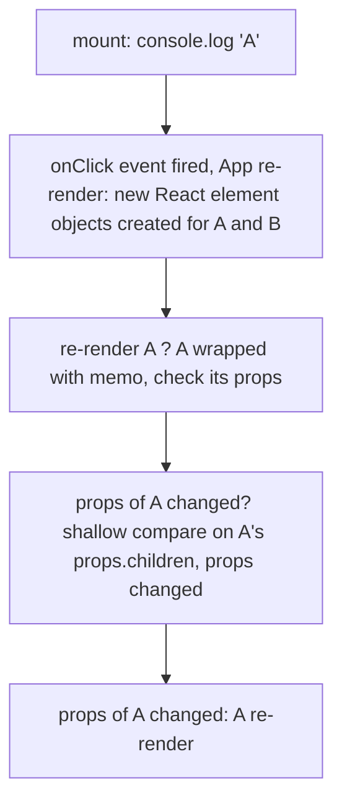
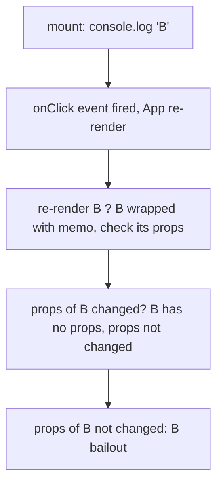
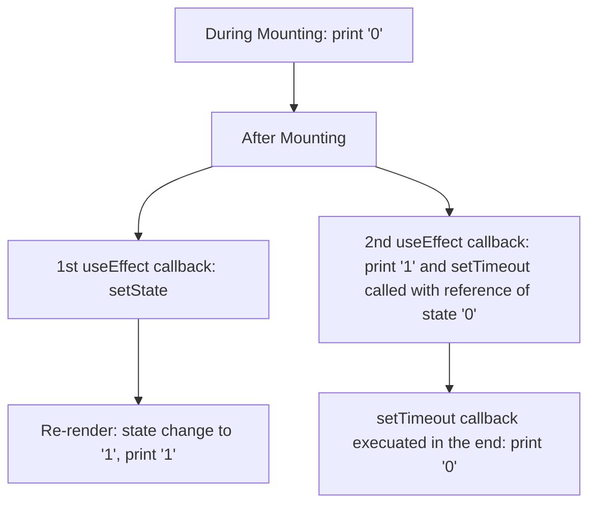

# Pro Tips to Unleash the Power of React
I've handpicked some representative React quizzes from bigfrontend.dev and compiled the key concepts they cover. I've also provided detailed explanation for each question I selected. 

As a React developer, mastering the knowledge shared in this article will elevate your understanding of the framework, enabling you to develop more seamlessly. 

This article is constantly being updated and refined, and I plan to incorporate more in-depth information about React's underlying mechanisms to offer even more insightful answers. 

## 1. Hooks
### 1.1 useState (rules also can be implemented to setState)       
- #### 1.1.1 <span id='jump-a-111'>async like setState</span>
  - setState acts in a async way in React      
  - #### Practice Questions: [16](#jump-q-16) 
- #### 1.1.2 initial states     
  - For useState, the callback function we pass to it will only be called once during mounting (first time rendering).
  - #### Practice Questions: [9](#jump-q-19)
- #### 1.1.3 <span id='jump-a-113'>setState and re-render</span>    
  - Triggering setState in a component can cause this component and its child components to be re-rendered.
  - #### Practice Questions: [9](#jump-q-9)

### 1.2 useEffect       
- #### 1.2.1 cleanup       
  - A React useEffect hook will call the cleanup function each time before the Effect runs again, before the related component unmount.      
  - #### Practice Questions: [21](#jump-q-21)      

- #### 1.2.2 dependencies     
  - For useEffect(), callbacks inside it are executed when its dependency changed. If the dependency of useEffect() is an empty array, code inside useEffect will only be called after first rendering.     
  - #### Practice Questions: [12](#jump-q-12)

### 1.3 useRef
- #### 1.3.1 do not trigger re-render 
  - Changes made to ref.current do not cause React to re-render.
  - #### Practice Questions: [21](#jump-q-21)      
- #### 1.3.2 when does DOM ref update
  - Before finishing rendering, ref.current of a DOM element will not be updated.
  - #### Practice Questions: [13](#jump-q-13)   

### 1.4 useContext
- #### 1.4.1 useContext and components re-render
  - In React, if there is a tiny little change in the context provider, components sharing the same context will get re-rendered.
  - #### Practice Questions: [9](#jump-q-9)   

### 1.5 useLayoutEffect
- #### 1.5.1 when React fires useLayoutEffect.
  - useLayoutEffect runs synchronously immediately after React has performed all DOM mutations.
  - #### Practice Questions: [19](#jump-q-19)   

---

## 2. Performance
### 2.1 memo
- #### 2.1.1 when memo fails
  - Memo fails when its props changed
  - #### **Practice Questions**: [11](#jump-q-11), [15](#jump-q-15)     

### 2.2 batching
- #### 2.2.1 batched setState calls      
  - To avoid unnecessary re-renders, React groups multiple state updates into one single re-render.
Before version 18, React does not batch updates outside React event handlers.     
  - #### Practice Questions: [5](#jump-q-5), [14](#jump-q-14)   

### 2.3 bailout
- #### 2.3.1 props
  - Children components passed as props to a component are not supposed to be re-rendered, unless the component's props are changed.
  - Props changes are detected by shallow comparison.
  - #### Practice Questions: [9](#jump-q-9), [11](#jump-q-11) 

---

## 3. Niches
### 3.1 flushSync
- #### 3.1.1 causing immediately re-render
  - FlushSync causes an immediately re-render for the current component, and makes setState() run synchronously.
  - FlushSync doesn’t break the guarantee of internal consistency
  - #### Practice Questions: [17](#jump-q-17)
### 3.2 suspense
- #### 3.2.1 Suspense lets you display a fallback until its children have finished loading.
  - If a children component suspends while rendering, the Suspense boundary will switch to rendering fallback.
  When the data is ready (the component has loaded), React will retry rendering the tree wrapped by the closest parent Suspense boundary from scratch.
  - #### Practice Questions: [8](#jump-q-8) 

        

### 3.3 Error boundary
- #### 3.3.1 propagation
  -  With React error boundaries, an error will be propagated to its closest error boundary.
  - #### Practice Questions: [20](#jump-q-20)

---

# Practice Questions
# <span id='jump-q-22'>22. useState()</span>
```js
import React, { useState } from 'react'
import ReactDOM from 'react-dom'
import { screen } from '@testing-library/dom'
import userEvent from '@testing-library/user-event'

function A() {
  console.log('render A')
  return null
}

function App() {
  const [_state, setState] = useState(false)
  console.log('render App')
  return <div>
    <button onClick={() => {
      console.log('click')
      setState(true)
    }}>click me</button>
    <A />
  </div>
}

ReactDOM.render(<App/>, document.getElementById('root'))

userEvent.click(screen.getByText('click me'))
userEvent.click(screen.getByText('click me'))
userEvent.click(screen.getByText('click me'))

```
<details><summary><b>Answer</b></summary>
<p>

```js
// mounting
'render App'
'render A'
// first click
'click'
'render App'
'render A'
// second click
'click'
'render App'
// third click
'click'
```
## Explanation
This question is designed to assess your comprehension of how React optimizes re-rendering by using bailouts.
#### 1. Updating state with the same value causes React to bail out.
> If you update a State Hook to the same value as the current state, React will bail out without rendering the children or firing effects.  
[React official document](https://reactjs.org/docs/state-and-lifecycle.html)
#### 2. React still needs to enter a component (to do some comparison) to make sure that a component should be bailed out.
Even if we don't update the state Hook to a different value on the second click, we still see "render App" printed because React needs to enter the App component to verify that no changes have been made and the App component should be bailed out. Once React has bailout the App component, its descendant components will not be re-rendered either.    

On the third click, there are no actual changes to the state, and the App component is bailed out, so only "click" is printed.

</p>
</details>

---

# <span id='jump-q-21'>21. useEffect() II</span>
```js
import React, { useState, useRef, useEffect } from 'react';
import ReactDOM from 'react-dom'

function App() {
  const [show, setShow] = useState(true)
  return <div>
    {show && <Child unmount={() => setShow(false)} />}
  </div>;
}

function Child({ unmount }) {
  const isMounted = useIsMounted()
  useEffect(() => {
    console.log(isMounted)
    Promise.resolve(true).then(() => {
      console.log(isMounted)
    });
    unmount(); 
  }, []);

  return null;
};

function useIsMounted() {
  const isMounted = useRef(false);

  useEffect(() => {
    isMounted.current = true;
    return () => isMounted.current = false;
  }, []);

  return isMounted.current;
}

const root = ReactDOM.createRoot(document.getElementById('root'));
root.render(<App/>)
```
<details><summary><b>Answer</b></summary>
<p>
  
```js
// mount 
false
// update
false
```

## Explanation
#### 1. Why the above code does not work as expected?
```js

function Child({ unmount }) {
  const isMounted = useIsMounted() // mounting
  useEffect(() => {
    console.log(isMounted) // mounted
    Promise.resolve(true).then(() => {
      console.log(isMounted) // update
    });
    unmount(); // called when mounted, cause an update
  }, []);

  return null;
};

function useIsMounted() {
  const isMounted = useRef(false); // mounting

  useEffect(() => {
    isMounted.current = true; // mounted
    return () => isMounted.current = false; // cleanup function called during next update
  }, []);

  return isMounted.current; // mounting
}
```
#### 2. Primitive V.S. Reference Data type in JavaScript
When you create a copy of a primitive value, such as a string or a number, it is completely independent of the original value. In other words, changing the copy will not affect the original value in any way.

However, when you make a copy of reference data, such as an object or an array, it's like duplicating a key to a house. If you use this copied key to enter the house and make any changes to the interior, these modifications will be reflected for anyone else who also has access to this house.

#### 3. How did a primitive data type affected the `useIsMounted` hook?
The value returned by ```useIsMounted``` is a snapshot of a primitive value during mounting, and any changes made to the ref after that moment will not affect this initialy returned value.   

It's worth noting that refs created by useRef does not automatically trigger a re-rendering. As a result, the initial value of isMounted```false``` is called twice.

You may also be curious about why `console.log(isMounted)` called with `Promise` is still false. To understand this, you need a little background knowledge about the execution context of each effect in React.

You can think of each render in React as a layer of dreams in the movie "Inception", and the data that useEffect can directly access is not infinite in time and space - it can only read the execution context that corresponds to the time when a useEffect was called. This is why the Promise `console.log(isMounted)` still shows the `isMounted` value generated during Child component's the initial rendering.

#### 4. How should we modify the above code to make it work as expected?
Before answering this question, let's do another quiz:    
What will be printed after runing the below code?
```js
import React, { useState, useRef, useEffect } from "react";
import ReactDOM from 'react-dom/client';

function App() {
  const [show, setShow] = useState(true);
  return <div>{show && <Child setShow={setShow} />}</div>;
}

function Child({ setShow }) {
  const isMounted = useIsMounted();

  useEffect(() => {
    console.log(isMounted.current);
    setShow(() => {
      console.log('update state');
      return false;
    });
  }, []);

  return null;
}

function useIsMounted() {
  const isMounted = useRef(2);

  useEffect(() => {
    isMounted.current += 3;
    return () => {
      isMounted.current *= 2
      console.log(isMounted.current);
    };
  }, []);

  return isMounted;
}

const root = ReactDOM.createRoot(
  document.getElementById('root')
);
root.render(< App />)
```
<details><summary><b>Answer</b></summary>
<p>

```js
// mounted
5
"update state"
// after state updated
10
```

Instead of returning just the isMounted.current value, we are now returning the entire isMounted object. This means although we are holding the reference key of the ref object created during mounting, and we can refer to an updated version of the `isMounted ref` in the componentDidMount lifecycle.

As a result, the logged `isMounted.current` values are as expected:
- **5**: After mounting, the `isMounted.current` value is 5, which is updated by the `useEffect` function in the custom hook.
- **10**: When `setShow` is triggered, it triggers a re-render of the App component, which causes the Child component to be unmounted and the cleanup function of `useIsMounted` to be called.
(**useEffect**: React will call your cleanup function each time before the Effect runs again, before the related component unmount)

As a result, isMounted.current = 10     
Note: the ref returned by `useIsMounted` references the same ref object during each rendering (to understand it, try to log `isMounted` in the above code). 

#### Recap: best practice of returning a ref in custom hooks
1. return the ref object itself in useIsMounted
2. call ref.current to access the latest value

</p>
</details>

</p>
</details>

---

# <span id='jump-q-20'>20. Error Boundary</span>
```js
import React, {Component} from 'react';
import ReactDOM from 'react-dom';

function renderWithError() {
  throw new Error('error');
}

function A() {
  return <ErrorBoundary name="boundary-2">{renderWithError()}</ErrorBoundary>;
}

function App() {
  return (
    <ErrorBoundary name="boundary-1">
      <A />
    </ErrorBoundary>
  )
}


class ErrorBoundary extends Component<
  { name: string; children: React.ReactNode },
  { hasError: boolean }
> {
  constructor(props) {
    super(props);
    this.state = { hasError: false };
  }

  static getDerivedStateFromError() {
    return { hasError: true };
  }

  componentDidCatch() {
    console.log(this.props.name);
  }

  render() {
    if (this.state.hasError) {
      return <h1>Something went wrong.</h1>;
    }

    return this.props.children;
  }
}

ReactDOM.render(<App/>, document.getElementById('root'))

```
<details><summary><b>Answer</b></summary>
<p>

```
boundary-1 
```

## Explanation
#### 1. When an error is caught by an ErrorBoundary, it stops propagating downwards and calls the componentDidCatch method. 
  
When using React error boundaries, an error will be propagated to its closest error boundary. 

So when we catch an error in component A, it will be propagated to its closest error boundary, which in this case is <ErrorBoundary name="boundary-1">.

#### 2. If the error is thrown by the ErrorBoundary component itself, it won't be caught by itself but by the nearest outer component instead. 
  
Since `renderWithError` is not even a component, the error will be caught by the nearest outer boundary-2. If `renderWithError` is a component, then the logged output could be "boundary-1"

#### 3. Practice question:
What will be printed in this case?
```javascript
import React, {Component} from 'react';
import ReactDOM from 'react-dom';

function renderWithError() {
  throw new Error('error');
}

function A() {
  return <ErrorBoundary name="boundary-4">{renderWithError()}</ErrorBoundary>;
}

export default function App() {
  return (
    <ErrorBoundary name="boundary-1">
      <ErrorBoundary name="boundary-2">
        <A />
      </ErrorBoundary>
    </ErrorBoundary>
  )
}


class ErrorBoundary extends Component<
  { name: string; children: React.ReactNode },
  { hasError: boolean }
> {
  constructor(props) {
    super(props);
    this.state = { hasError: false };
  }

  static getDerivedStateFromError() {
    return { hasError: true };
  }

  componentDidCatch() {
    console.log(this.props.name);
  }

  render() {
    if (this.state.hasError) {
      return <h1>Something went wrong.</h1>;
    }

    return this.props.children;
  }
}
```

<details><summary><b>Answer</b></summary>
<p>

```
boundary-2 
```

This time, when we catch an error in A, it propagates to the closest error boundary outside of A, aka boundary-2.

</p>
</details>

</p>
</details>

---
# <span id='jump-q-19'>19. lazy initial state</span>
```js
import React, { useState, useEffect } from 'react'
import ReactDOM from 'react-dom'

function App() {
  const [state1, setState1] = useState(1);

  const [state2] = useState(() => {
    console.log(2);
    return 2;
  });

  console.log(state1);

  useEffect(() => {
    setState1(3);
  }, []);

  return null;
}

ReactDOM.render(<App/>, document.getElementById('root'))
```
<details><summary><b>Answer</b></summary>
<p>

```
// mounting
2
1
// updating
3
```

## Explanation
#### 1. In React hooks, we use `useState` to set up initial states. 
When we call `useState`, the callback function we pass to it will only be executed during mounting, aka before the component is rendered to the DOM for the first time. This is necessary to ensure that the initial states are properly set before rendering the component.

In this specific code, both `console.log(2)` and `console.log(state1)` are executed during mounting. As `console.log(2)` is executed before `console.log(state1)`, we see "2" and "1" printed in the console.

#### 2. Callbacks passed to useState only be called during mounting, statements placed in the body of a function component (at the top level) are executed each time the component is rendered.
When we call `setState1()`, it triggers a component update, and the newly updated value of state1 (which is 3) will be printed. Also, since `console.log(2)` is inside a `useState` callback function, it is only called once during mounting and not printed in subsequent re-renders.
  
</p>
</details>

---
# <span id='jump-q-18'>18. useRef 2</span>
```js
import React, { useRef, useLayoutEffect } from 'react'
import ReactDOM from 'react-dom'

function App() {
  const ref = useRef(false)

  useLayoutEffect(() => {
    console.log(1)
    ref.current = true
  })

  return <button
    autoFocus
    onFocus={() => {
      console.log(!!ref.current)
    }}
    >
    button
  </button>
}

ReactDOM.render(<App/>, document.getElementById('root'))
```
<details><summary><b>Answer</b></summary>
<p>

```
// mount
false
1
```
## Explanation
#### 1. A user event finished before the browser layout?  
This question is quite interesting, as it mentions a browser event that will be completed before the layout phase. Here, onFocus is triggered by autoFocus. This happens during DOM mutation, and useLayoutEffect occurs after DOM mutation. So we see the onFocus event running before useLayoutEffect.

However, generally speaking, most browser events won't run before useLayoutEffect. The useLayoutEffect hook is designed to run as soon as the component has been updated in the DOM, before the browser has had a chance to perform layout or paint.

The autoFocus case is a somewhat unique situation because it is a browser-level behavior that focuses the element as soon as it is inserted into the DOM. This behavior can lead to the onFocus event being triggered before useLayoutEffect has a chance to run.  
  
#### 2. onFocus and useLayoutEffect
Looking at the call stack of onFocus and useLayoutEffect, you will find the callback function of onFocus() is called before commitMount, and the callback of useLayoutEffect is called after commitMount.
So we printed ref.current before setting it to true.
  
#### 3. useRef
Changes made to ref.current do not cause React to re-render. Without re-rendering, the new value of ref.current is not printed here.

</p>
</details>

---

# <span id='jump-q-17'>17. flushSync()</span>
```js
import React, { useState } from 'react'
import ReactDOM, { flushSync } from 'react-dom'
import { screen } from '@testing-library/dom'
import userEvent from '@testing-library/user-event'

function App() {
  const [state, setState] = useState(0)
  const onClick = () => {
    console.log('handler')
    flushSync(() => {
      setState(state => state + 1)
    })
    console.log('handler ' + state)
  }
  console.log('render ' + state)
  return <div>
    <button onClick={onClick}>click me</button>
  </div>
}

ReactDOM.render(<App/>, document.getElementById('root'))
// click the button
userEvent.click(screen.getByText('click me'))
```
<details><summary><b>Answer</b></summary>
<p>

```js
// mount
render 0
// click event
handler
// flushSync event, causing an immediately re-render within the current component
render 1
// rest of the click event
hanlder 0 // 
```

## Explanation
#### 1. We call flushSync to update the DOM synchronously 
FlushSync triggers an immediate re-render of the current component, and makes the `setState(state => state + 1)` function run synchronously.     
This also explains why we see the App component re-render before the `console.log('render ' + state)` function is called.
#### 2. FlushSync doesn’t break the guarantee of internal consistency
> FlushSync forces complete re-rendering, for updates that happen inside the call. But it doesn’t break the guarantee of internal consistency between props, state, and refs.

This ensures the lines of code after `flushSync` still acts like what it supposed to be. 
That's why even we see the state inside `console.log('handler ' + state)` is still '0', not affected by results of `flushSync`.

</p>
</details>

---

# <span id='jump-q-16'>16. event callback</span>
```js
import React, { useState } from 'react'
import ReactDOM from 'react-dom'
import { screen } from '@testing-library/dom'
import userEvent from '@testing-library/user-event'

function App() {
  const [state, setState] = useState(0)
  const onClick = () => {
    console.log('handler')
    setState(state => state + 1)
    console.log('handler ' + state)
  }
  console.log('render ' + state)
  return <div>
    <button onClick={onClick}>click me</button>
  </div>
}

ReactDOM.render(<App/>, document.getElementById('root'))
// click the button
userEvent.click(screen.getByText('click me'))
```
<details><summary><b>Answer</b></summary>
<p>

```js
// mount
render 0
// click event
handler
hanlder 0
// update
render 1 
```

## Explanation
This question mainly tests your understanding about setState.  
#### 1. setState acts asynchronously in React
Therefore, when we call `console.log('handler ' + state)`, `setState(state => state + 1)` is not execuated and state is not updated yet.  
This results in 'handler 0' for console.log('handler ' + state).

#### 2. state changes trigger re-render
`SetState(state + 1)` triggers state change and re-render App.
Re-rendering App causes `console.log('handler ' + state)` to run again.

</p>
</details>

---

# <span id='jump-q-15'>15. memo 2</span>
```js
import React, { memo, useState } from 'react'
import ReactDOM from 'react-dom'
import { screen } from '@testing-library/dom'
import userEvent from '@testing-library/user-event'

function _B() {
  console.log('B')
  return null
}

const B = memo(_B)

function _A({ children }) {
  console.log('A')
  return children
}

const A = memo(_A)

function App() {
  const [count, setCount] = useState(0)
  return <div>
    <button onClick={
      () => setCount(count => count + 1)
    }>
      click me
    </button>
    <A><B/></A>
  </div>
}

ReactDOM.render(<App/>, document.getElementById('root'))

userEvent.click(screen.getByText('click me'))

```
<details><summary><b>Answer</b></summary>
<p>

```js
// mounting
A
B
// update 
A
```

## Explanation
The first 2 logs are from the first time rendering, which is unavoidable.   
Why after the App is re-rendered, we only get A?
- When the App is re-rendered, A's props.children is about to change. Also, as memo becomes ineffective when props change, this causes A will be re-rendered. 
- B has no props, so it won't be re-rendered.
#### 1. Memo fails when its props changed
This code tried to avoid re-rendering by using memo, but memo only works when its props are not changed.   
  
#### 2. What happened to App:


#### 3. What happened to A:



#### 4. What happened to B:



</p>
</details>

---

# <span id='jump-q-14'>14. async event handler</span>
```js
import React, { useState } from 'react'
import ReactDOM from 'react-dom'
import { screen } from '@testing-library/dom'
import userEvent from '@testing-library/user-event'

function App() {
  const [state, setState] = useState(0)
  const increment = () => {
    setTimeout(() => {
      setState(state + 1)
    }, 0)
  }
  console.log(state)
  return <div>
    <button onClick={increment}>click me</button>
  </div>
}

ReactDOM.render(<App/>, document.getElementById('root'))

// click the button twice
userEvent.click(screen.getByText('click me'))
userEvent.click(screen.getByText('click me'))
```
<details><summary><b>Answer</b></summary>
<p>

```js
// mount
0
// setState(state + 1)
1
// setState(state + 1)
1
```
## Explanation
This question tests your understanding about automatic batching.

#### 1. Before version 18, React does not batch updates outside React event handlers.
> Batching is when React groups multiple state updates into a single re-render for better performance.  
Before version 18, React only batched updates inside React event handlers. Updates inside of promises, setTimeout, native event handlers, or any other event were not batched in React by default.

So in React 17, when our mock of 2 click events are fired, 2 setState(state + 1) calls will cause 2 re-renders.    
This is because setState(state + 1) were wrapped inside setTimout (outside React event handlers) and would not be automatically batched.    
As a result, we have number "1" logged twice.

#### 2. Automatic Batching in React 18
When it comes to React 18, the answer of this question is changed.     
Can you guess what will be logged by the previous code running in React 18?


<details><summary><b>View Answer</b></summary>
<p>

```js
// mount  
0
// update  
1
```

## Explanation
The two batched setState() calls only cause 1 re-render,    
since React 18 begins to batch setState calls regardless of setTimeout().          

If you are still a little bit confused, to make it clear, you can replace the input of setState with a random number.

```js
export default function App() {
  const [state, setState] = useState(0);

  useEffect(() => {
    // click the button twice
    userEvent.click(screen.getByText("click me"));
    userEvent.click(screen.getByText("click me"));
  }, []);

  const increment = () => {
    setTimeout(() => {
      const randomNum = Math.random();
      console.log('random', randomNum);
      setState(randomNum);
    }, 0);
  };
  console.log('render', state);
  return (
    <div>
      <button id="btn" onClick={increment}>
        click me
      </button>
    </div>
  );
}
```
For React 18, we have:
```js
// mount
render 0
// click events
random 0.7874529322933663
random 0.31142343139325157
// re-render 1
render 0.31142343139325157

```
For React 17, we have:
```js
// mount
render 0

// click event
random 0.6529578729308463
// re-render 1
render 0.6529578729308463

// click event
random 0.636291442544388
// re-render 2
render 0.636291442544388
```

</p>
</details>
  
</p>
</details>

---

# <span id='jump-q-13'>13. useRef</span>
```js
import React, { useRef, useEffect, useState } from 'react'
import ReactDOM from 'react-dom'

function App() {
  const ref = useRef(null)
  const [state, setState] = useState(1)

  useEffect(() => {
    setState(2)
  }, [])

  console.log(ref.current?.textContent)

  return <div>
    <div ref={state === 1 ? ref : null}>1</div>
    <div ref={state === 2 ? ref : null}>2</div>
  </div>
}

const root = ReactDOM.createRoot(document.getElementById('root'));
root.render(<App/>)
```
<details><summary><b>Answer</b></summary>
<p>

```js
// mount
undefined

// update
1
```

## Explanation
#### 1. If you set <code>ref.current</code> to a JSX node, ref.current will not be updated until rendering is finished. 
This is why when logging <code>ref.current?.textContent</code> during mounting, the above code only gets <code>undefined</code>. As it is still rendering, <code>ref.current</code> is not updated yet.

```js
// after mounting  
<div>
    <div ref={ref}>1</div>
    <div ref={null}>2</div>
  </div>

```

#### 2. During each re-rendering, we are always refering to the same ref object.  
When we triggered <code>setState</code> in <code>useEffect</code>, a component will be re-rendered. However, no matter how many times your component is re-rendered, a ref always points to the ref object, created when the component was first rendered. 

#### 3. Changing `ref.current` will not cause a component to re-render.   
A ref object doesn’t trigger a re-render when you change it. For example, even though the latest <code>ref.current?.textContent</code> is 2, it is not logged as changing a ref object does not call the component to re-render and log the updated value.  

after 2nd time rendering
```js
<div>
    <div ref={null}>1</div>
    <div ref={ref}>2</div>
  </div>

```

</p>
</details>

---

# <span id='jump-q-12'>12. useEffect</span>
```js
import React, { useEffect, useState } from 'react'
import ReactDOM from 'react-dom'

function App() {
  const [state, setState] = useState(0)
  console.log(state)

  useEffect(() => {
    setState(state => state + 1)
  }, [])

  useEffect(() => {
    console.log(state)
    setTimeout(() => {
      console.log(state)
    }, 100)
  }, [])

  return null
}

ReactDOM.render(<App/>, document.getElementById('root'))
```
<details><summary><b>Answer</b></summary>
<p>

```
// mounting
0
// mounted
0
// state updated
1
// async macrotask setTimeout referencing the state from the previous rendering
0
// setTimeout capsulated with states in the initial rendering cycle. Although its callback is executed after the next rendering cycle is ready, this does not interfere with the consistency of its scope
```

## Explanation
This question tests your understanding about when useEffect fires.
#### 1. For useEffect(), callbacks inside it are execuated when its dependency changed. 

```javascript
  const [number, updateNumber] = useState(0); 
  useEffect(() => {
    // code
  }, [number])
```
For the above code, everytime when number changes, the callback inside this useEffect will be called.

#### 2. What if the dependency of useEffect() is an empty array?
In this case, code inside useEffect will only be called after first rendering (mounting).

Back to our code:
```js
  console.log(state)

  useEffect(() => {
    setState(state => state + 1)
  }, [])

  useEffect(() => {
    console.log(state)
    setTimeout(() => {
      console.log(state)
    }, 100)
  }, [])
```

As you can see, both of the 2 useEffect only have an empty array as their dependency. This means callbacks of the 2 useEffect() will be called after mounting.


  
#### 3. If you want to understand the knowledge behind this question
This question shows the common stale closure problem in React hooks. To understand the stale closure problem of React hooks, you need to understand what React does after triggering setState. 
#### Think deeply about setState  
- SetState triggered Re-rendering will create a new layer of state snapshots. 
To understand state snapshot, here is a simple analogy: if a component is rendered 10 times, it is equivalent to taking 10 new photos for this changing component (instead of directly modifying the component for 10 times). 
- Different layers of state snapshots are independent. This means, it is possible for a function to run with a previous state context, resulting in what we called `stale closure`. 
  
Before continuing to explain, let me ask you a question first. 
- For the state in the second useEffect, which state snapshot does it refers to?
```jsx
  useEffect(() => {
    console.log(state)
    setTimeout(() => {
      console.log(state)
    }, 100)
  }, [])
```
The `useEffect(() => {}, [])` hook only points to the state of the first rendering of the component. This means the execution context of `setTimeout()`'s callback is the mounting state snapshot. In such a case, even if we trigger a `setState` to change the value of state and create a layer of state snapshot for the re-render, `setTimeout(() =>; { console.log(state) }, 100)` always read the state value of the first rendering state snapshot.
</p>
</details>

---

# <span id='jump-q-11'>11. callback props</span>
```js

import React, { memo, useState} from 'react'
import ReactDOM from 'react-dom'
import { screen, fireEvent } from '@testing-library/dom'

function _A({ onClick }) {
  console.log('A')
  return <button onClick={onClick} data-testid="button">click me</button>
}

const A = memo(_A)

function App() {
  console.log('App')
  const [state, setState] = useState(0)
  return <div>
    {state}
    <A onClick={() => {setState(state => state + 1)}}/>
  </div>
}

const root = ReactDOM.createRoot(document.getElementById('root'));
root.render(<App/>);

// click the button
;(async function() {
  const button = await screen.findByTestId('button')
  fireEvent.click(button)
})()
```
<details><summary><b>Answer</b></summary>
<p>

```
// mount
App
A

// update
App
A
```

## Explanation
#### 1. Memo lets you skip re-rendering a component when its props are unchanged  
Obviously, here `memo` does not memorize component `_A`, because `_A`’s props are changing.      
Every time <code>App</code> is rendered, <code>onClick</code> corresponds to a new reference value for the function, causing <code>_A</code>’s props to change constantly and <code>memo</code> does not take effect. 

#### 2. React uses shallow comparison to detect changes in props and state  
Shallow comparison only checks the first layer of properties of an object. If the values of the properties referenced are the same, they are considered equal.     
Every time `App` is rendered, <code>onClick</code> is given a new reference value, which leads to the problem mentioned earlier that <code>_A</code>’s props are constantly changing.
```
 function _A({ onClick }) {
  console.log('A');
  return <button onClick={onClick} data-testid="button">click me</button>;
}

const A = memo(_A);

export default function App() {
  console.log('App');
  const [state, setState] = useState(0);

  const handleClick = useCallback(() => {
    setState((state) => state + 1);
  }, []);

  return (
    <div>
      {state}
      <A onClick={handleClick} />
    </div>
  );
}
```
The <code>useCallback</code> function is used to wrap the <code>handleClick</code> callback function, so that the reference of the <code>onClick</code> callback remains unchanged.
</p>
</details>

---

# <span id='jump-q-9'>9. React re-render 6 - Context</span>
```js
import React, { useState, createContext, useEffect, useContext} from 'react'
import ReactDOM from 'react-dom'

const MyContext = createContext(0);

function B({children}) {
  const count = useContext(MyContext)
  console.log('B')
  return children
}

const A = ({children}) => {
  const [state, setState] = useState(0)
  console.log('A')
  useEffect(() => {
    setState(state => state + 1)
  }, [])
  return <MyContext.Provider value={state}>
    {children}
  </MyContext.Provider>
}

function C() {
  console.log('C')
  return null
}

function D() {
  console.log('D')
  return null
}
function App() {
  console.log('App')
  return <A><B><C/></B><D/></A>
}

const root = ReactDOM.createRoot(document.getElementById('root'));
root.render(<App/>)
```

<details><summary><b>Answer</b></summary>
<p>

```js
// mounting
App
A
B
C
D
// state updated
A
B
```
## Explanation
#### 1. When triggering setState in a component, it will cause this component and its child components to be re-rendered.         
From the above code, we can see that when we trigger setState in component A, only component A will be re-rendered, which does not affect the parent component App of A, nor does it affect sibling component D.

#### 2. How to avoid child components from being re-rendered
When A's child components are inherited from its parent component through children props, A's re-rendering will not cause the inherited children props components to be re-rendered.         
Components C and D belong to A's props inherited from App. When A is re-rendered, App has not changed and A's props have not changed, so C and D components will not be rendered due to A's re-rendering. But why did B component, which is also A's props.children, re-render?

#### 3. How to make children components inherited from props re-render
When a component and its children inherited from props share a context, modifying the context in component A will cause all components that call the same context to be re-rendered.       
This is why even if B component is inherited from A's props.children, because A and B share MyContext and A modifies MyContext, it causes B component to be re-rendered.

#### 4. To test your understanding, you can take a look at this case:
```js
  import React, { useState, useEffect } from 'react'
import ReactDOM from 'react-dom'

function A({ children }) {
  console.log('A')
  return children
}

function B() {
  console.log('B')
  return <C/>
}

function C() {
  console.log('C')
  return null
}

function D() {
  console.log('D')
  return null
}

function App() {
  const [state, setState] = useState(0)
  useEffect(() => {
    setState(state => state + 1)
  }, [])
  console.log('App')
  return (
    <div>
      <A><B/></A>
      <D/>
    </div>
  )
}

const root = ReactDOM.createRoot(document.getElementById('root'));
root.render(<App/>)
```
  

<details><summary><b>Answer</b></summary>
<p>

```js
// mounting
App  
A
B
C
D
// state updated
App
A
B
C
D
```
B and C were re-rendered because A's parent component re-rendered, resulting in a new object of props for A.   
Note: React uses shallow compare to detect whether the props are changed or not. So even if we have not see real changes made to props of A, React still considers that it has props changes.
  
</p>
</details>

</p>
</details>

---
# <span id='jump-q-8'>8. Suspense 2</span>
```js
import { StrictMode } from "react";
import { createRoot } from "react-dom/client";
import React, { useState, useRef, useEffect, Suspense } from "react";
import ReactDOM from "react-dom/client";

const resource = (() => {
  let data = null;
  let status = "pending";
  let fetcher = null;
  return {
    get() {
      if (status === "ready") {
        return data;
      }
      if (status === "pending") {
        fetcher = new Promise((resolve, reject) => {
          setTimeout(() => {
            data = 1;
            status = "ready";
            resolve();
          }, 2000);
        });
        status = "fetching";
      }

      throw fetcher;
    }
  };
})();

function A() {
  console.log("A1");

  return (
    <>
      <C />
      <D />
    </>
  );
}

function D() {
  console.log("D");
  return null;
}

function C() {
  resource.get();
  console.log("C");
  return <E />;
}

function E() {
  console.log("E");
  return <div>E</div>;
}

function B() {
  useEffect(() => {
    resource.get();
  }, []);
  console.log("B");
  return <div>B</div>;
}

function Fallback() {
  console.log("fallback");
  return <p>fallback</p>;
}

function App() {
  console.log("App");
  return (
    <div>
      <Suspense fallback={<Fallback />}>
        <A />
        <B />
      </Suspense>
    </div>
  );
}

const rootElement = document.getElementById("root");
const root = ReactDOM.createRoot(rootElement);

root.render(<App />);
```

<details><summary><b>Answer</b></summary>
<p>

```js
App
A1
D
B
fallback
A1
C
E
D
B
```   
## Explanation
#### 1. If children suspends while rendering, the Suspense boundary will switch to rendering fallback
- Why didn’t component C and its child components render during first time rendering?

Because component C made a data request that can be recognized by Suspense, React will not attempt to continue rendering the part of the subtree that made the data request until it completes the data request, so C and E are not rendered and logged but fallback is.

#### 2. In Suspense, after Suspense-enabled data requests are completed, the subtree wrapped by Suspense will be re-rendered
That's why we see the App is re-rendered from the children of Suspense. (App is outside Suspense and not re-rendered)

#### 3. Suspense does not detect when data is fetched inside an Effect or event handler.
Data requests initiated in useEffect will not be detected by Suspense, which is why component B was rendered and not suspended during initial rendering.
</p>
</details>

---
# <span id='jump-q-5'>5. Automatic batching 1</span>
```js

import React, { useState } from 'react'
import ReactDOM from 'react-dom'
import { screen } from '@testing-library/dom'
import userEvent from '@testing-library/user-event'

function App() {
  const [state, setState] = useState(0)
  console.log("App " + state)
  return (
    <div>
      <button onClick={() => {
        setState(count => count + 1)
        setState(count => count * 2)
      }}>click me</button>
    </div>
  )
}

(async () => {
  const root = ReactDOM.createRoot(document.getElementById('root'));
  root.render(<App/>)

  userEvent.click(await screen.findByText('click me'))
})()
```

<details><summary><b>Answer</b></summary>
<p>

```js
App 0
App 2
```    
## Explanation
- App 0 This log is triggered when the App component is first rendered.
- App 2 This log is triggered after React merges two setState calls into one re-render.
#### 1. Multiple setState calls during the same cycle may be batched together.
React batches setState calls to avoid unnecessary re-rendering.

#### 2. Background knowledge: setState (as well as useState hook setter) is a trigger of a series of underground React process 
Before we explain why batching exists, let's introduce some background knowledge about why setState triggers a re-render. If you're new to React, you might think that using setState to modify state values simply means modifying data. However, when you call setState (or useState's setter function), this triggers a series of underlying operations in React, including reconciling changes to the component tree, marking changes, and committing rendering. Therefore, setState is not just a data modification function; it's more like a trigger button for a series of underlying operations in React.

#### 3. Why batching is needed
So, without batching, the above code would trigger two rounds of underlying React operations unnecessarily. If you look closely at this code, you'll find that there's no need to perform two rounds of re-rendering; it's actually equivalent to this single rendering:
```
setState(count => (count + 1) * 2)
```
Therefore, in order to avoid unnecessary re-rendering like the above example, React uses batching to merge the two setState operations in the original code into one, so that only one re-render is triggered in the end.

## References
- [What is batching?](https://github.com/reactwg/react-18/discussions/21)
</p>
</details>

---
